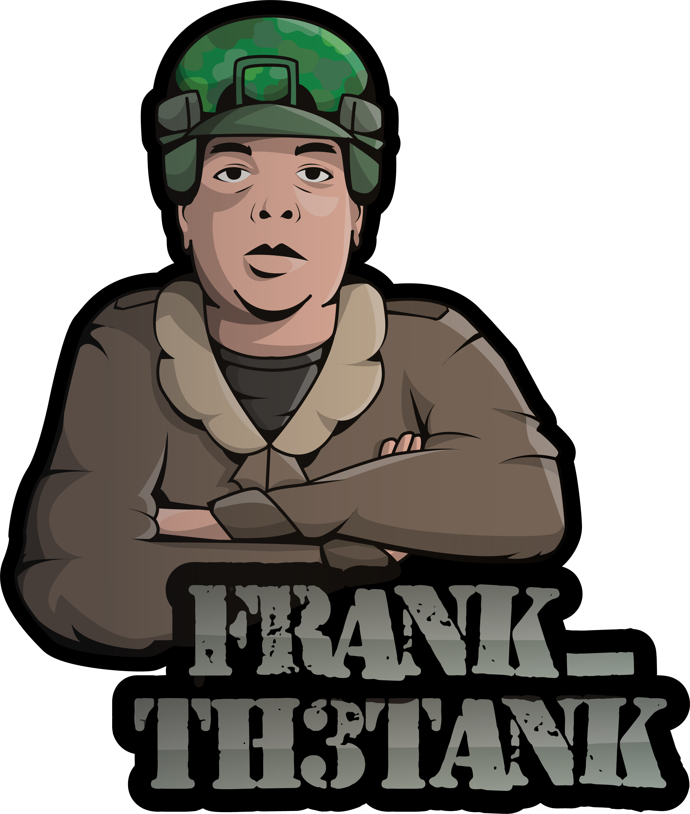
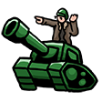
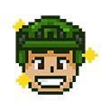
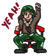

  
  

        
    

    
    <h1>
        Welcome!!
        
    </h1>

  

---

###  About Me :

### I am a Software Engineer working at IBM 

-  I’m working as a Software Engineer and contributing to frontend and backend for building web applications.

-  Avid Game Developer.

-  In my free time, I love mentoring and helping others getting into tech.

- How to reach me: 

### :hammer_and_wrench: Languages and Tools :

  &nbsp;
  &nbsp;
  &nbsp;
  &nbsp;
  &nbsp;
  &nbsp;
  &nbsp;
  &nbsp;
  &nbsp;
  &nbsp;
  &nbsp;
  &nbsp;
  &nbsp;
  &nbsp;
  

<!--
**frankth3tank/frankth3tank** is a ✨ _special_ ✨ repository because its `README.md` (this file) appears on your GitHub profile.

Here are some ideas to get you started:

- 🔭 I’m currently working on ...
- 🌱 I’m currently learning ...
- 👯 I’m looking to collaborate on ...
- 🤔 I’m looking for help with ...
- 💬 Ask me about ...
- 📫 How to reach me: ...
- 😄 Pronouns: ...
- ⚡ Fun fact: ...
  -->
